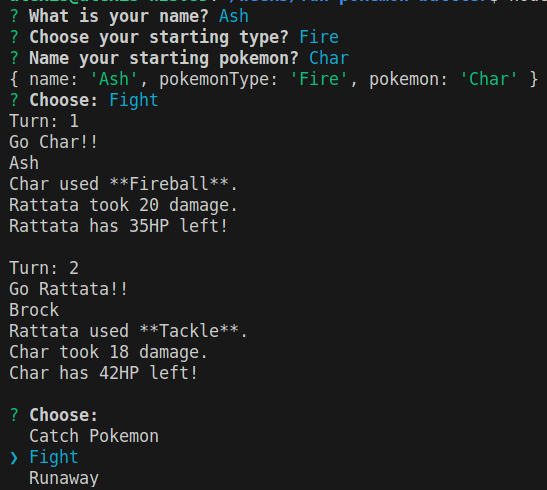

# Pokemon Battle Game

Simple command-line-based Pokemon battle game implemented in JavaScript using TDD methodology. Players can create their trainer, choose their starting Pokemon, catch more Pokemon, and engage in battles against the computer.

## Features

- Object-oriented design
- Ability to create trainers with a team of Pokemon
- Battle system with turn-based combat
- Pokemon types and move effectiveness
- Catching Pokemon
- Interactive command-line interface using the inquirer library

## Classes
- Pokemon: Base class representing a Pokémon with attributes such as name, hit points, attack damage, and moves.
- Fire, Water, Grass, Normal: Subclasses representing specific Pokémon types, inheriting from the Pokémon class and providing type-specific functionality.
- Trainer: Class representing a trainer, managing a team of Pokémon stored in Pokéballs.
- Pokeball: Class representing a Pokéball, used for catching and storing Pokémon.
- Battle: Class representing a battle between two trainers, handling turn-based combat logic.

